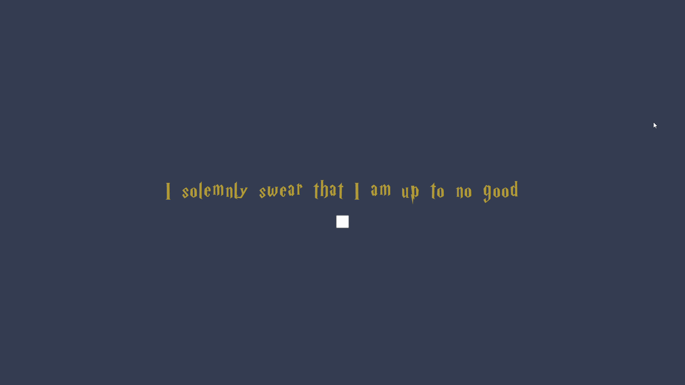
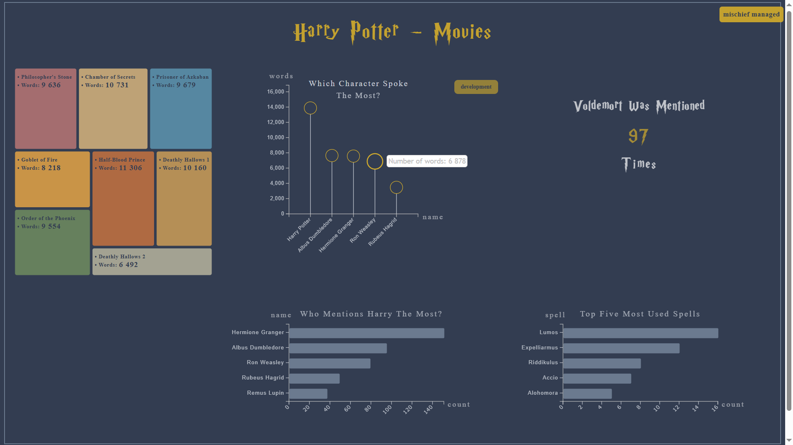
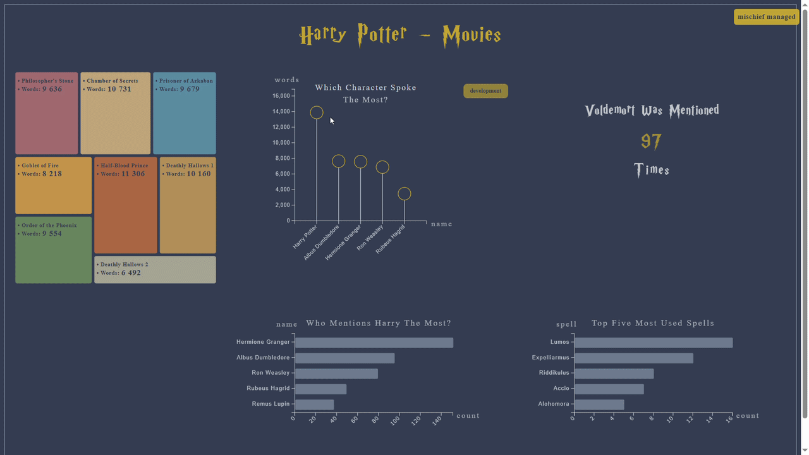
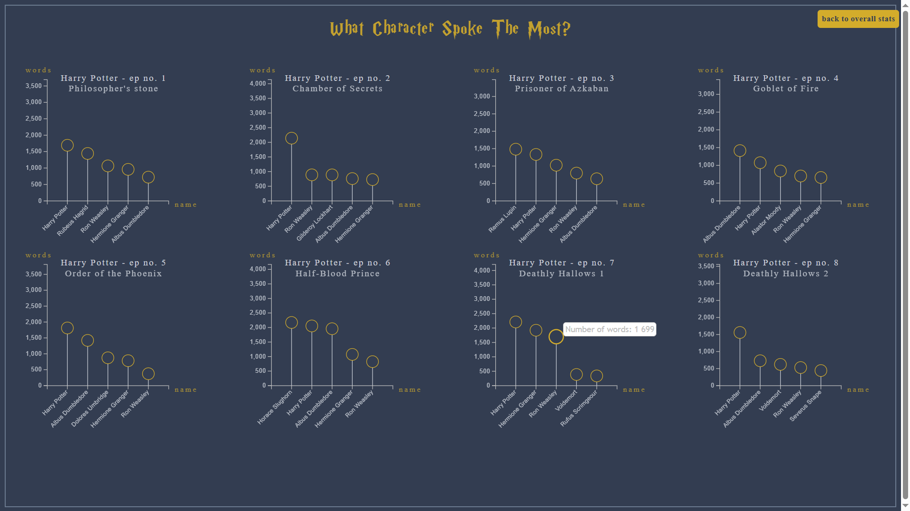

# Interactive Data Visualization with D3.js
This project is an interactive D3.js visualization website based on Harry Potter movie data. It explores dialogue patterns, character word counts, spell usage, character mentions, and character-specific statistics across the movie series.

The project uses preprocessed data derived from the [Harry Potter Movies Dataset](https://www.kaggle.com/datasets/maricinnamon/harry-potter-movies-dataset). The visualizations are presented across several pages using lollipop charts, bar charts, donut charts, proportional area charts, small multiples, tooltips, and page navigation.

## Screenshots

### Landing page



### Overview page



### Character detail page



### Development statistics page



## Features

- Multi-page interactive visualization website
- D3.js charts built from preprocessed CSV datasets
- Landing page with animated transition
- Overview page with multiple chart types
- Character-specific pages for selected characters
- Development view showing character dialogue patterns across movies
- Hover interactions, tooltips, highlighting, and page navigation

## Visualizations

The project includes several visual views:

- Lollipop chart showing which characters spoke the most across the movie series
- Bar chart showing which characters mention Harry the most
- Bar chart showing the most frequently used spells
- Proportional area chart showing word counts across movies
- Large highlighted number showing how often Voldemort is mentioned
- Donut charts showing character-specific word distribution across movies
- Character-specific bar charts showing where selected characters spend the most dialogue time
- Small multiples showing the top speaking characters in each movie

## Project structure

```text
.
├── index.js
├── package.json
├── package-lock.json
├── README.md
├── fonts/
├── readme_imgs/
└── public/
    ├── index.html
    ├── charts.html
    ├── developmentStats.html
    ├── HarryPotter.html
    ├── HermioneGranger.html
    ├── RonWeasley.html
    ├── AlbusDumbledore.html
    ├── RubeusHagrid.html
    ├── main.css
    ├── myD3app.js
    ├── donutchart.js
    ├── smallMultiples.js
    └── data files
```

## Main files

### `index.html`

Landing page with the “I solemnly swear that I am up to no good” entry interaction. When the user activates the checkbox, the page fades out and redirects to the main visualization page.

### `charts.html`

Main overview page. It contains the primary visualizations, including the lollipop chart, bar charts, proportional area chart, and Voldemort mention count.

### `developmentStats.html`

Page containing small multiples that show which characters spoke the most in each movie.

### Character pages

The following pages show character-specific visualizations:

- `HarryPotter.html`
- `HermioneGranger.html`
- `RonWeasley.html`
- `AlbusDumbledore.html`
- `RubeusHagrid.html`

Each character page uses reusable logic from `donutchart.js`, with the character name passed as a parameter. The page displays a donut chart showing that character’s word distribution across movies and a bar chart showing the places where the character has the most dialogue.

### `myD3app.js`

Contains the main overview page logic, including:

- loading preprocessed CSV files,
- drawing the overview lollipop chart,
- drawing bar charts,
- drawing the proportional area chart,
- displaying the Voldemort mention count,
- adding tooltips and hover interactions.

### `donutchart.js`

Contains the reusable character-detail visualization logic, including:

- character-specific donut charts,
- word counts by movie,
- character-specific place/dialogue bar charts,
- hover interactions and dynamic labels.

### `smallMultiples.js`

Contains the small multiples visualization showing the top speaking characters across individual Harry Potter movies.

### `main.css`

Contains the main styling for layout, colors, typography, buttons, and hover effects.

## Data

The visualizations are based on preprocessed Harry Potter movie data. The original dataset used for preprocessing is the [Harry Potter Movies Dataset](https://www.kaggle.com/datasets/maricinnamon/harry-potter-movies-dataset).

The preprocessed CSV files are stored in the `public/` folder and loaded directly by the D3.js scripts.

Examples of preprocessed datasets used in the project include:

- character word counts
- words spoken per movie
- most frequently used spells
- mentions of Harry
- most visited places per character
- top speaking characters per movie

## How to run

Install dependencies:

```bash
npm install
```

Start the local server:

```bash
node index.js
```

Open the project in a browser:

```text
http://localhost:3000
```

## Technologies used

- HTML
- CSS
- JavaScript
- D3.js
- Node.js

## Font attribution

The Harry Potter style font used in the project is from FontSpace:  
[Harry P Font](https://www.fontspace.com/harry-p-font-f44342)

## Notes

This project was created as an interactive data visualization exercise. The focus was on preprocessing data for visualization, building multiple chart types with D3.js, and designing interactive pages for exploring dialogue and character patterns across the Harry Potter movie series. The design is not responsive.
